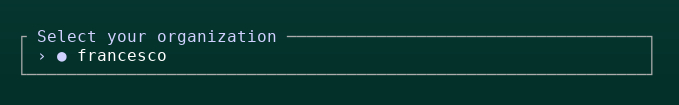
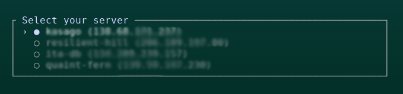
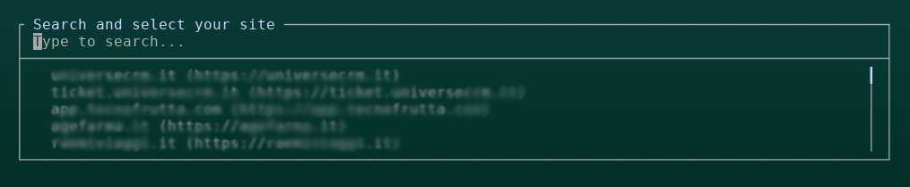

# Laravel Forge Logs

[](https://packagist.org/packages/frankflow/laravel-forge-logs)
[](https://github.com/frankflow/laravel-forge-logs/actions?query=workflow%3Arun-tests+branch%3Amain)
[](https://github.com/frankflow/laravel-forge-logs/actions?query=workflow%3A"Fix+PHP+code+style+issues"+branch%3Amain)
[](https://packagist.org/packages/frankflow/laravel-forge-logs)

A Laravel package that integrates with the [Laravel Forge API](https://forge.laravel.com/docs/api-reference/introduction) to fetch and manage application logs from your Forge-managed sites. Simplify log retrieval and monitoring with interactive CLI commands.

## Why this package
With the use of AI, it is increasingly necessary to access logs remotely to speed up bug fixing.

## Features

- Interactive setup wizard to configure your Forge organization, server, and site
- Fetch application logs directly from Laravel Forge
- Store logs locally for analysis
- Simple artisan commands for easy integration

## Requirements

- PHP 8.4+
- Laravel 11.x or 12.x

## Installation

You can install the package via Composer:

```bash
composer require frankflow/laravel-forge-logs
```
 
## Get Your Laravel Forge API Token

First, obtain your API token from Laravel Forge:

1. Log in to [Laravel Forge](https://forge.laravel.com)
2. Go to your account settings
3. Navigate to the API section
4. Generate a new API token

## Add Your Forge Token to .env

Add the following line to your `.env` file:

```env
FORGE_TOKEN=your-forge-api-token-here
```


## Run the Interactive Setup

Run the initialization command to configure your organization, server, and site:

```bash
php artisan forge-init
```


This interactive command will:
1. Fetch and display your available Forge organizations
   

2. Fetch and display servers for the selected organization
   

3. Allow you to search and select your site
   

4. Automatically update your `.env` file with the configuration


## USAGE: Fetching Logs

Once configured, fetch your application logs with:

```bash
php artisan forge-fetch-log
```

The logs will be saved to `storage/logs/laravel.log` by default.


## [Optional] Publishing Configuration

Publish the configuration file:

```bash
php artisan vendor:publish --tag="forge-logs-config"
```

This will create a `config/forge-logs.php` file with the following structure:

```php
return [
    'forge_token' => env('FORGE_TOKEN'),
    'forge_server_id' => env('FORGE_SERVER_ID'),
    'forge_site_id' => env('FORGE_SITE_ID'),
    'forge_organization' => env('FORGE_ORGANIZATION'),
];
``` 

## Testing

```bash
composer test
```

## Changelog

Please see [CHANGELOG](CHANGELOG.md) for more information on what has changed recently.

## Contributing

Please see [CONTRIBUTING](CONTRIBUTING.md) for details.

## Security Vulnerabilities

Please review [our security policy](../../security/policy) on how to report security vulnerabilities.

## Credits

- [FrankFlow](https://github.com/FrankFlow)
- [All Contributors](../../contributors)

## License

The MIT License (MIT). Please see [License File](LICENSE.md) for more information.
